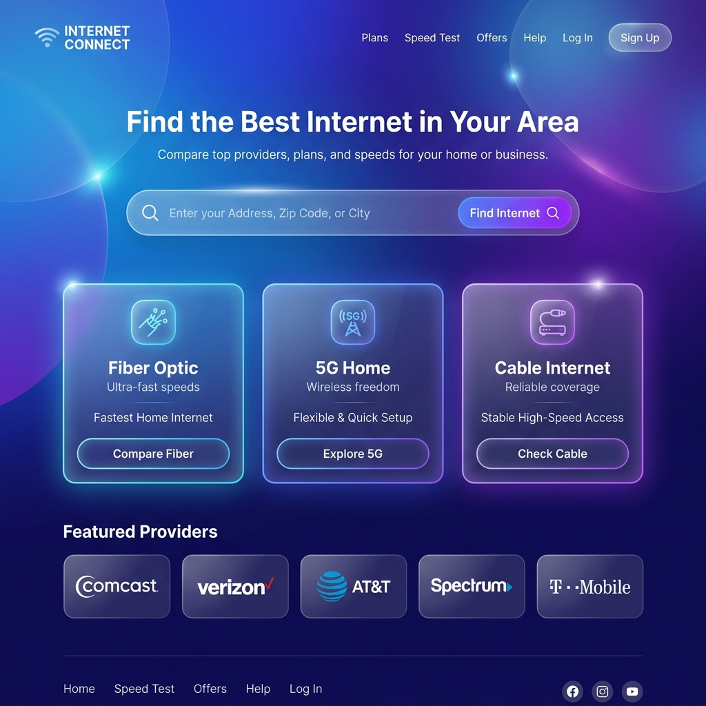
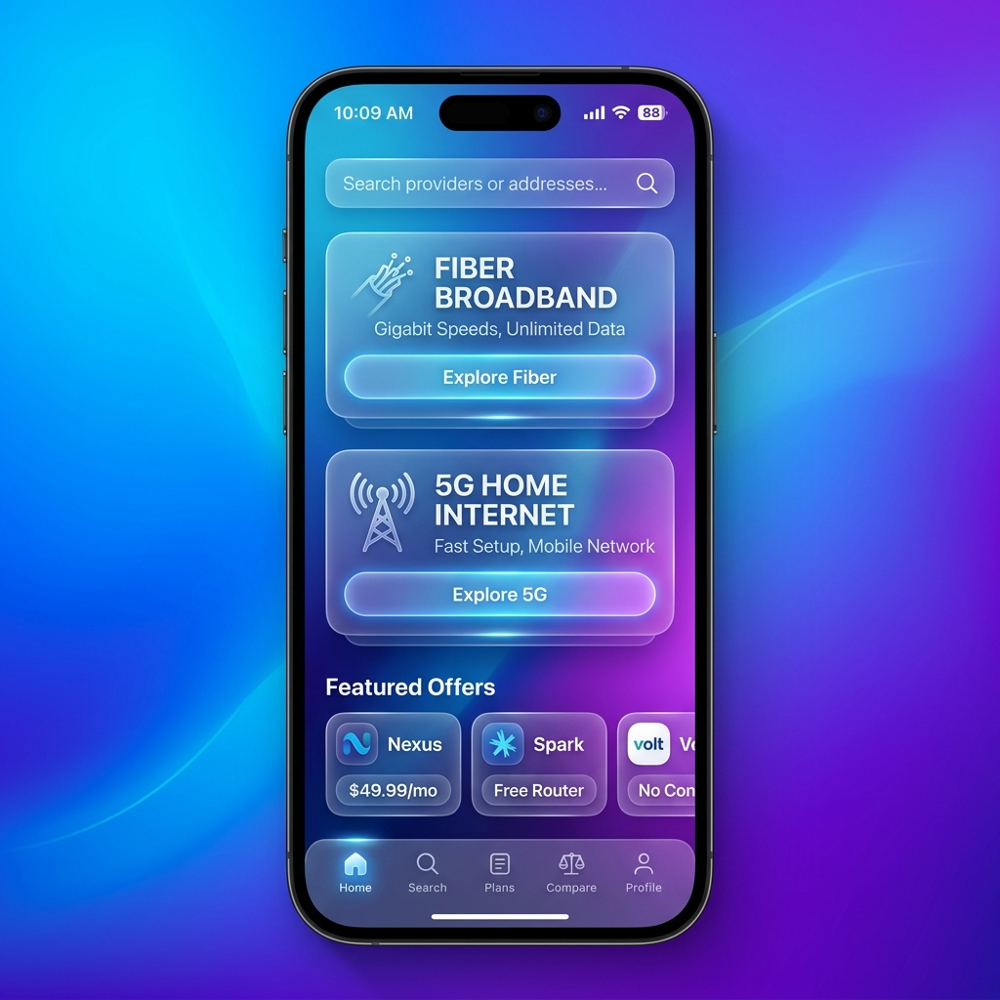
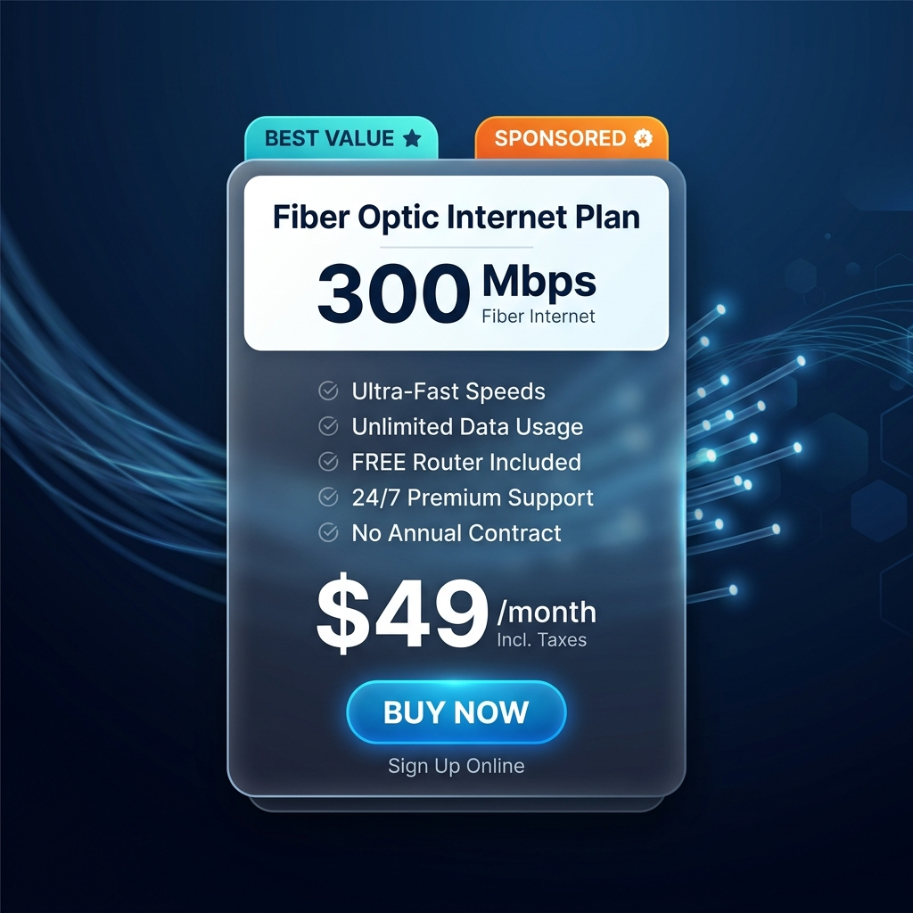

# Frontend Design System & Mockups

Dokument opisuje założenia wizualne oraz architekturę UI dla frontendu "Porównywarki Internetu". Całość opiera się na nowoczesnym stylu **Liquid Glass (Glassmorphism)**, wykorzystującym półprzezroczyste elementy, głębokie gradienty tła (granatowo-fioletowe) oraz płynne animacje.

## 1. Wersja Desktop (Strona Główna)

Strona główna wita użytkownika centralną wyszukiwarką. 
**Logika:** Pasek wyszukiwania przekierowuje użytkownika bezpośrednio do ofert w wybranym mieście (np. wpisanie "Warszawa" kieruje na `/miasta/warszawa`). Poniżej znajdują się karty kategorii (Światłowód, 5G, Kabel).

## 2. Wersja Mobile (Mobile-first, App-like feel)

Aplikacja mobilna zachowuje spójność z wersją desktop, ale jest zoptymalizowana pod kątem dotyku.
**Logika:** 
- Wyszukiwarka na górze ekranu.
- Karty kategorii ułożone pionowo (stacking).
- Na samym dole znajduje się dolny pasek nawigacyjny (Bottom Navigation Bar) z ikonami (Home, Search, Plans, Compare, Profile), co daje wrażenie korzystania z natywnej aplikacji.

## 3. Boxy Sprzedażowe (Karty Ofert / Affiliate)

Kluczowy element konwersji. Karta oferty prezentuje parametry planu i kieruje do zewnętrznego partnera (operatora) poprzez link afiliacyjny.

**Logika:**
- Widoczne parametry: Prędkość (np. 300 Mbps), Cena, Główne benefity.
- **Odznaki (Badges):** Piktogramy "Best Value" lub "Sponsored" zwiększające CTR.
- **CTA:** Wyraźny, wyróżniający się przycisk "Buy Now", podłączony pod `/api/redirect/[id]`, który zapisuje log kliknięcia (`ClickEvents`) i przekierowuje do partnera.

## 4. Wytyczne Techniczne (TailwindCSS)

- **Tło Główne:** `bg-gradient-to-br from-blue-900 to-indigo-900`
- **Efekt Szkła (Glass):** `bg-white/10 backdrop-blur-lg border border-white/20 shadow-xl`
- **Główny Kolor Akcentu:** Wibrujący błękit/cyjan (np. `text-cyan-400`, `bg-cyan-500`)
- **Typografia:** Nowoczesny font bezszeryfowy (np. Inter lub system-ui), mocne kontrasty bieli z ciemnym tłem.
- **Ruch (Motion):** `transition-all duration-300`, delikatne podnoszenie kart przy `:hover` (`-translate-y-1`), łagodne pojawianie się (fade-in).

---
*Dokument wygenerowany jako część planu wdrożeniowego AI.*
